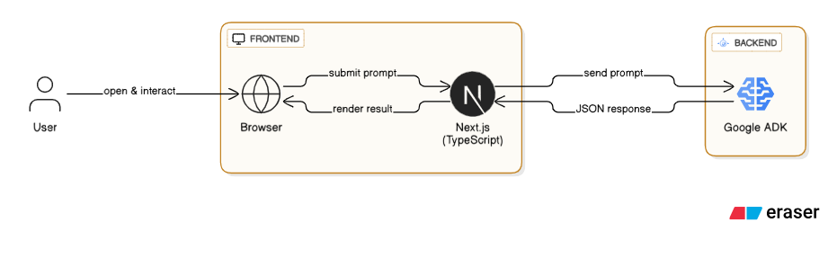
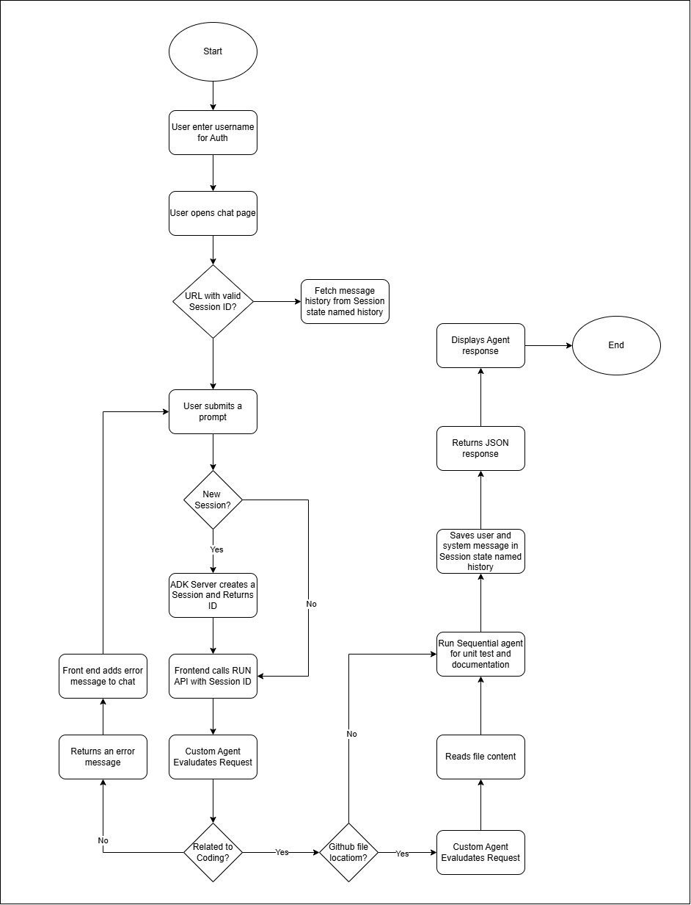

# CodeCraft.AI

CodeCraft.AI is an innovative project designed to streamline and automate various aspects of the software development lifecycle, focusing on **code refactoring**, **documentation**, and **unit test generation**. It comprises a **Next.js frontend** for an intuitive user experience and a powerful **Google ADK (Agent Development Kit) backend** housing intelligent agents.

---

## Features

* **Intelligent Request Handling:** The `input_decide_agent` intelligently processes user queries, ensuring they are coding-related.
* **GitHub Integration:** The `file_read_agent` can fetch code directly from GitHub URLs or local file paths, making it easy to work with existing projects.
* **Automated Code Refactoring:** The `code_refactor_agent` helps improve code quality and maintainability.
* **Automatic Documentation Generation:** The `code_documentation_agent` creates comprehensive documentation for your code.
* **Automated Unit Test Generation:** The `unit_test_agent` generates robust unit tests to ensure code correctness.
* **Session History:** User queries and system responses are stored in a session `history` for easy reference.
* **Fixed Output Key:** The system response is consistently stored in a `final_output` state for seamless frontend integration.

---

## Architecture

CodeCraft.AI's backend is built using the Google ADK, leveraging a **FastAPI server** for robust API communication. The core of the system revolves around a **Custom Agent named `UnitTestGeneratorFlowAgent`**.

[](architecture.png)
_Architecture Diagram_

[](flow.png)
_Flow Diagram_

### Agents

The project utilizes several specialized agents:

* **`input_decide_agent`**: The initial point of contact for user requests. It determines the validity of a query and whether it pertains to coding.
* **`file_read_agent`**: Responsible for reading code from specified GitHub URLs or local file paths.
* **`code_refactor_agent`**: Focuses on analyzing and suggesting improvements for code structure and design.
* **`code_documentation_agent`**: Generates comprehensive documentation based on the provided code.
* **`unit_test_agent`**: Creates relevant and effective unit tests for the given code.

### Agent Flow

1.  **Initial Request:** User requests are first processed by the `input_decide_agent`.
    * If the request is not coding-related, an error message is returned.
    * If the request is valid, processing continues.
2.  **File Retrieval (Conditional):** If the user's message contains a GitHub URL or file path, the `file_read_agent` is executed to fetch the relevant code.
3.  **Sequential Processing:** The retrieved code (or directly provided code) is then passed to a **`SequentialAgent` named `sequential_agent`**, which is instantiated within the `UnitTestGeneratorFlowAgent`. This `sequential_agent` orchestrates the execution of its sub-agents in a predefined order:
    * `code_refactor_agent`
    * `code_documentation_agent`
    * `unit_test_agent`
4.  **Session Management:** The `UnitTestGeneratorFlowAgent` maintains a session state named `history` (a list of dictionaries) to store user queries and system responses, enabling conversational context.
5.  **Frontend Communication:** The final system response is stored in a dedicated `final_output` state, ensuring the Next.js frontend has a consistent key to retrieve and display the server's response.

---

## Getting Started

### Prerequisites

* Node.js (for Next.js frontend)
* Python 3.8+ (for Google ADK backend)

### Installation

1.  **Clone the repository:**
    ````bash
    git clone [https://github.com/ritwikmath/codecraft-ai.git](https://github.com/ritwikmath/codecraft-ai.git)
    ````

#### Backend

1.  **Navigate to the backend directory:**
    ````bash
    cd codecraft-ai/adk_backend
    ````
2.  **Create and activate a virtual environment:**
    ````bash
    python -m venv venv
    # On Windows
    .\venv\Scripts\activate
    # On macOS/Linux
    source venv/bin/activate
    ````
3.  **Install dependencies:**
    ````bash
    pip install -r requirements.txt
    ````
4.  **Run the FastAPI server:**
    ````bash
    python main.py
    ````

#### Frontend

1.  **Navigate to the frontend directory:**
    ````bash
    cd codecraft-ai/adk_frontend
    ````
2.  **Install dependencies:**
    ````bash
    npm install
    ````
3.  **Run the development server:**
    ````bash
    npm run dev
    ````

---

## Usage

1.  Open your browser and navigate to `http://localhost:3000/`.
2.  Click on the button labeled **"Chat with us"**.
3.  If prompted, provide a user name.
4.  For a new chat session, type in a **Session name** and then write your **prompt**. This can be raw Python code or a GitHub file URL (e.g., `https://github.com/ritwikmath/codecraft-ai/blob/main/adk_backend/main.py`).
5.  Click **Submit** to initiate the process.

---

## Contributing

We welcome contributions! Please refer to our `CONTRIBUTING.md` (to be created) for guidelines on how to contribute to CodeCraft.AI.

---

## License

This project is licensed under the [MIT License](LICENSE) (to be created).
